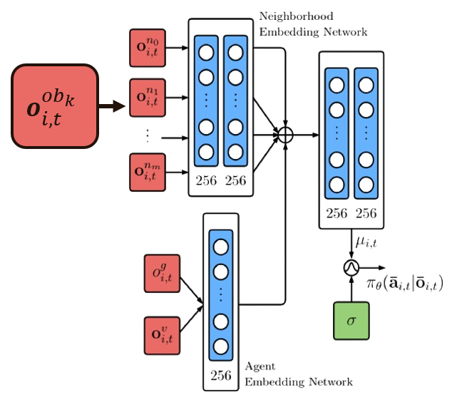
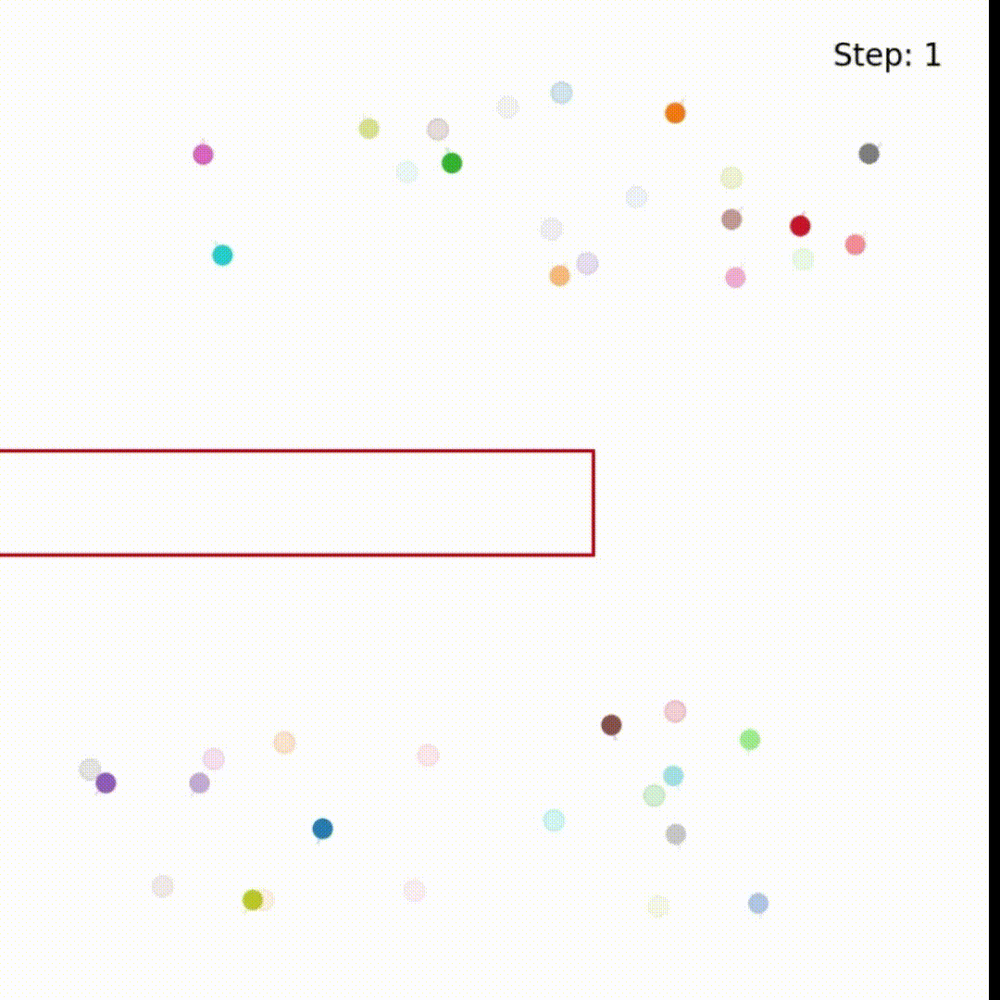
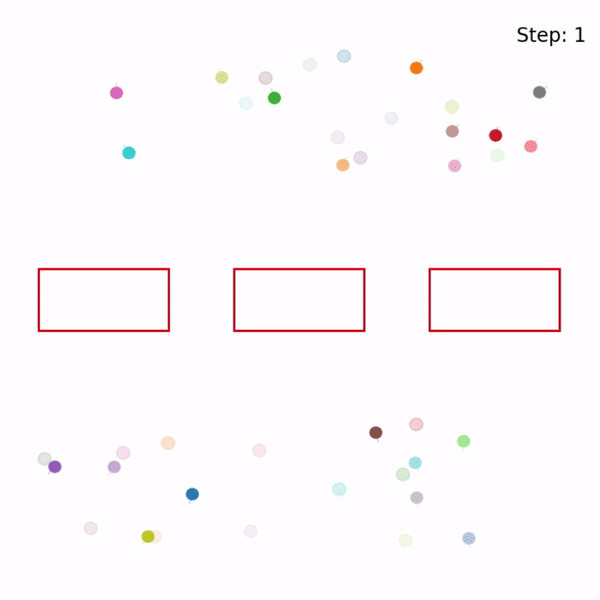
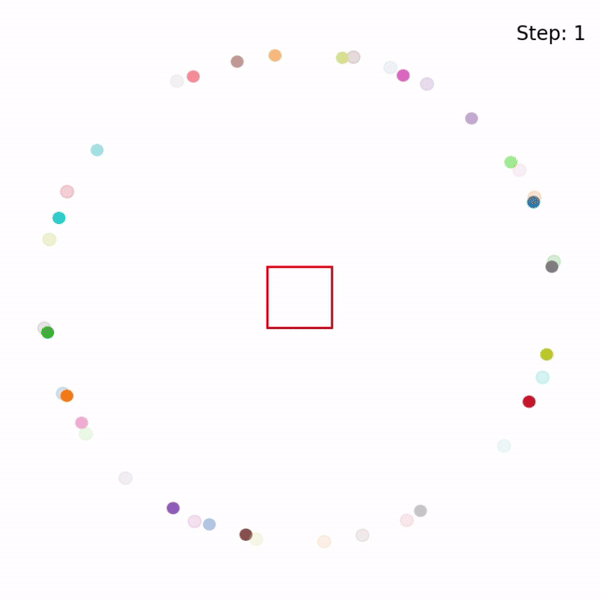

# Human-Inspired Multi-Agent Navigation using Knowledge Distillation in Obstacle Environment

This is project of deep reinforcement learning class in KMUTT university, this project inspired multi-agent navigation framework from this paper **Human-Inspired Multi-Agent Navigation using Knowledge Distillation**. [[arXiv](https://arxiv.org/abs/2103.10000)][[Youtube](https://youtu.be/tMctyEw8kRI)]. We try to add obstacles into multi-agent environment by adding the obstacle observation in agent's state which using same layer as neighbor observation in neural network policy.

## Dependencies
For dependencies and how to use multi-agent navigation framework, you can follow the tutorial from original KDMA github [[KDMA](https://github.com/xupei0610/KDMA)]

## Obstacle Environment

### Obstacle observation
We add obstacle observation where it consists of relative position and velocity of obstacle respect to the agent as same as neighbor observation. This obstacle observation consists of 60 points of obstacle around the agent and we input it at the same embedding layer as neighbor observation in policy neural network, as shown in below picture.

### Our obstacle scenario
We inherit corridor scenario from KDMA framework where agents randomly spawn in both side of corridor and their goal is in opposite side. We add obstacle between agent's spawn point and their goal, The agents must navigate around obstacles instead of run straight ahead to goal and also avoid the other agents as the same time.

After many experiments, we got the new policy for obstacle scenario as shown in above animation. We also provided new set of parameter that different from the original KDMA which more suitable for our obstacle environment, shown in below table.

| Collision Reward | Velocity regularization weight (w_v) | Knowledge distillation weight (w_e)| 
|-----------|-----------|----------|
| -0.3 | 0.06 | 0.04 |

The performance of our policy is shown in below table.

| Collision Rate | Success Rate | Reward | Termination Time (sec) |
|------|-----------|------|------|
| 0.30 | 0.53 | 1.23 | 87.54 |

### Extra scenario
We also provide 2 simple scenarios and testing our policy that trained in above obstacle scenario with them.

## Code Usage

About how to train the policy, you can follow the tutorial from original KDMA github [[KDMA](https://github.com/xupei0610/KDMA)]
In this part we show just about how we add obstacle observation into agent's state.

### Visualize our scenarios
We provide our pre-trained action policy with obstacle scenario in the folder `log/action_policy`. To visualize the action policy, please run `visualize.py`:

    $ python visualize.py --ckpt log/action_policy/ckpt --scene <scene>

for scene argument, you need to replace it with scenario's name, we provided 3 obstacle scenario named 20-static_wall, 20-static_wall_circle, and 20-static_wall_splited (you can also use original scenario from KDMA)

### Changing type of obstacle observation
We have 2 types of Obstacle Observation (You can select each type by changing parameter in **config.py**)
-   Only nearest obstacle point where we input only the nearest point of each obstacle into agent's state. (To use this type, change <code style="color : aqua">ONLY_NEAREST=True</code>)
-   Obstacle points around the agent where we input desired number of obstacle points around agent into agent's state. (To use this type, change <code style="color : aqua">ONLY_NEAREST=False</code> and specify the desired number of points <code style="color : aqua">OBSEREVD_POINTS=60</code> **Maximum is 360**)

## Citation
    @inproceedings{kdma,
        author={Xu, Pei and Karamouzas, Ioannis},
        booktitle={2021 IEEE/RSJ International Conference on Intelligent Robots and Systems (IROS)}, 
        title={Human-Inspired Multi-Agent Navigation using Knowledge Distillation}, 
        year={2021},
        volume={},
        number={},
        pages={8105-8112},
        doi={10.1109/IROS51168.2021.9636463}
    }
